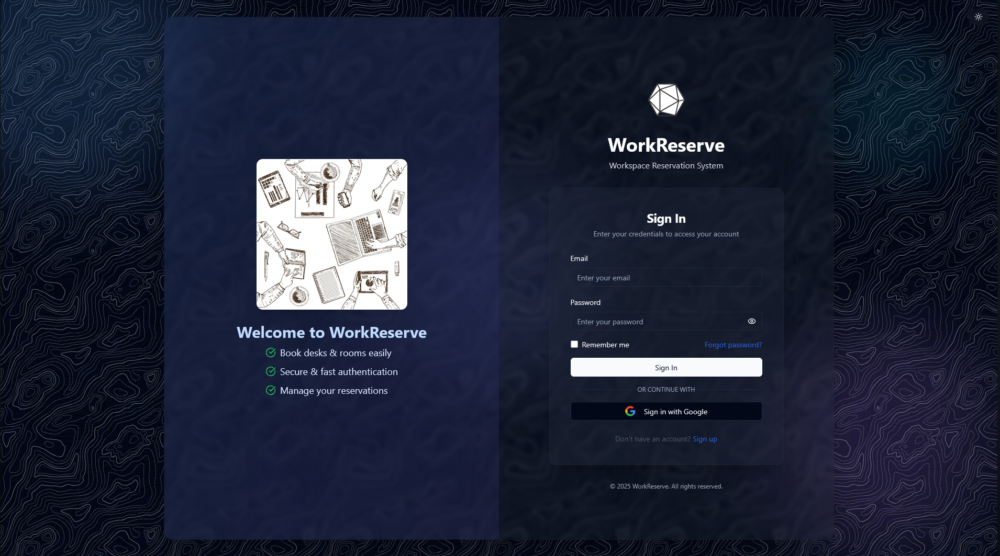
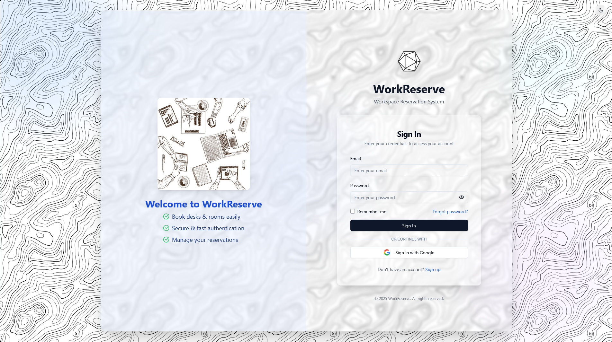
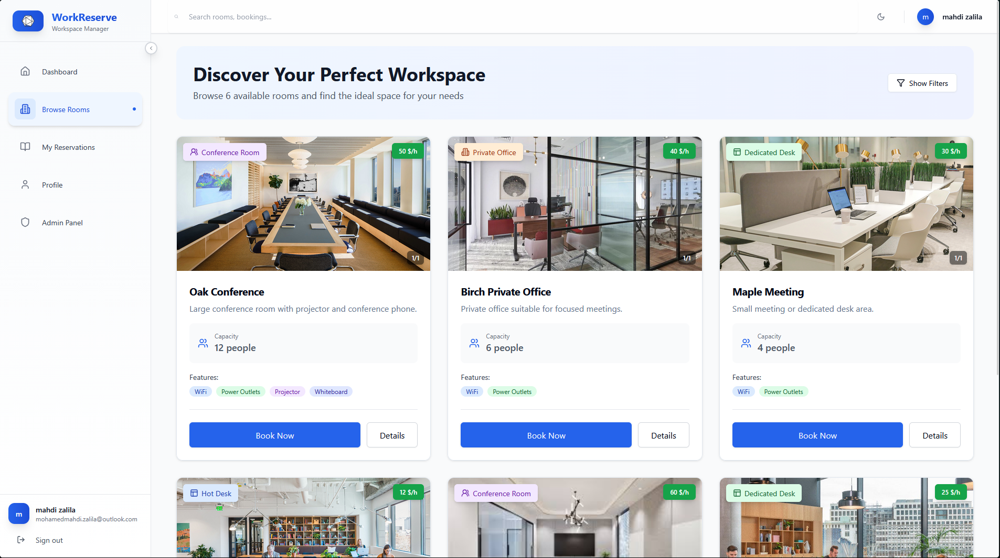
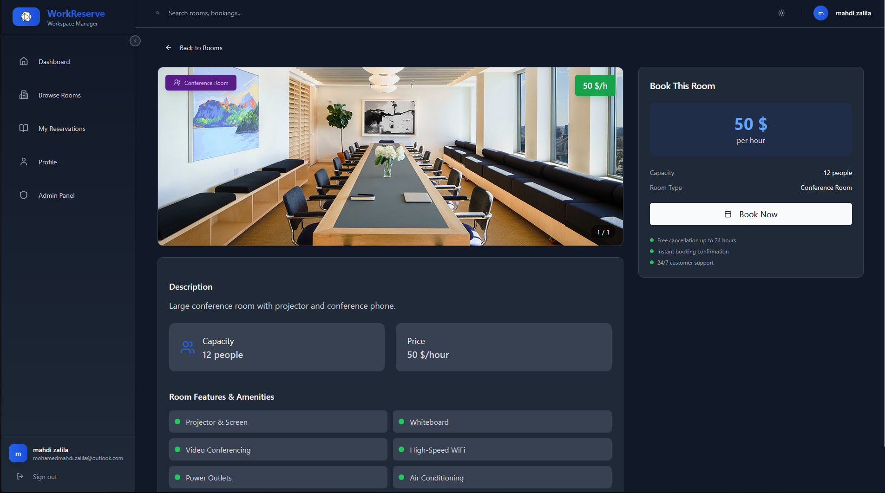
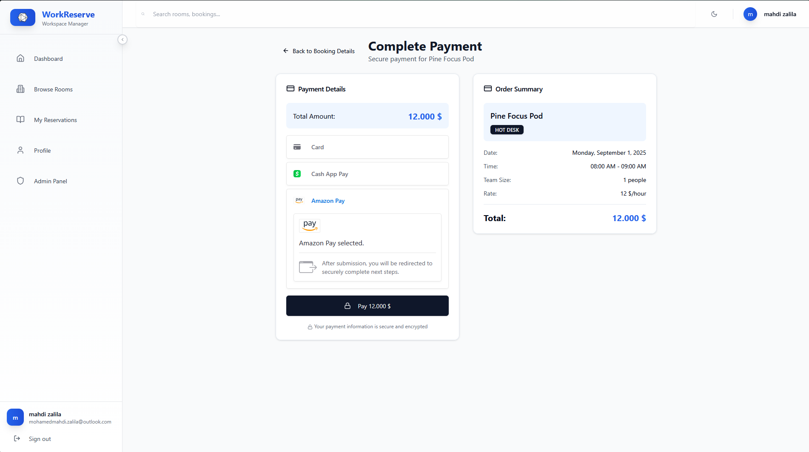

<div align="center">

<h1>WorkReserve</h1>

**Modern workspace reservation & management platform**  
*Rooms • TimeSlots • Reservations • Secure Auth • 2FA • Payments • Caching • Auditing*

<!-- Badges -->
<p>
  
  
  
  
  
  
  
  
  
  
  
  
</p>

[View Full Report (Rapport de Stage)](Rapport.pdf) | [Live Demo](https://workreserve-frontend.onrender.com) | [Contact](#contributing)

</div>

---

## Table of Contents
- [Quick Glance](#quick-glance)
- [Tech Stack](#tech-stack)
- [Architecture Overview](#architecture-overview)
- [Repository Structure](#repository-structure)
- [Environment Configuration](#environment-configuration)
- [Setup & Run](#setup--run)
- [Deployment](#deployment)
- [Key Features & Contributions](#key-features--contributions)
- [Screenshots](#screenshots)
- [Testing & Quality](#testing--quality)
- [Monitoring & Observability](#monitoring--observability)
- [Contributing](#contributing)
- [License](#license)

---

## Quick Glance

| Area | Highlights |
|------|------------|
| **Booking** | Real-time availability, conflict-safe reservations with Stripe integration |
| **Payments** | Stripe PaymentIntent (USD), retry & idempotent logic for reliability |
| **Security** | JWT + Role-based (USER/ADMIN), Optional 2FA with TOTP & backup codes |
| **Performance** | Caffeine caching (rooms, timeslots, availability, user context) – 40% DB load reduction |
| **Resilience** | Exponential backoff for Stripe rate/lock timeouts, multi-cloud redundancy |
| **UX** | Animated flows (Framer Motion), calendar-driven booking with React Big Calendar |
| **Extensibility** | Modular services, planned local payment provider abstraction |
| **Observability** | Structured logging for payment + reservation lifecycles, Spring Boot Actuator |
| **Testing** | 87% backend coverage (JUnit/Mockito), 83% frontend (Jest/RTL), integration tests |

---

## Tech Stack

### Backend
- **Framework**: Spring Boot 3.2.5 (Java 21)
- **Security**: JWT (JJWT), TOTP 2FA, BCrypt hashing, OAuth2 Google
- **Database**: PostgreSQL (prod) / H2 (dev/test)
- **Cache**: Caffeine (in-memory, multi-level)
- **Payments**: Stripe Java SDK (PaymentIntent, idempotent retries)
- **Build**: Maven Wrapper

### Frontend
- **Framework**: React 19.1.0 + TypeScript 5.8.3
- **Build Tool**: Vite 7.0.0
- **UI/UX**: Tailwind CSS 3.4.17, Radix UI, Framer Motion 12.23.0
- **Forms**: React Hook Form 7.59.0 + Zod 3.25.73 validation
- **State**: React Query, Axios for API calls
- **Calendar**: React Big Calendar 1.19.4

### DevOps & Deployment
- **CI/CD**: GitHub Actions (automated tests, builds)
- **Cloud**: Multi-cloud deployment (Render + Azure) for redundancy
- **Containerization**: Docker (multi-stage builds, health checks)
- **Monitoring**: Spring Boot Actuator, Azure Application Insights

---

## Architecture Overview

  

### Core Components
- **Authentication**: JWT tokens with optional 2FA (TOTP)
- **Reservations**: Real-time availability checks, conflict resolution
- **Payments**: Stripe PaymentIntent with idempotent confirmation
- **Caching**: Multi-level (rooms, slots, user context) with event-driven invalidation
- **Security**: Role-based access, CSRF protection, input validation

---

## Repository Structure

```
workreserve/
├── backend/                          # Spring Boot application
│   ├── src/main/java/com/workreserve/backend/
│   │   ├── auth/                     # JWT, 2FA, OAuth
│   │   ├── room/                     # Room management
│   │   ├── reservation/              # Booking logic
│   │   ├── timeslot/                 # Slot generation/cleanup
│   │   ├── payment/                   # Stripe integration
│   │   └── config/                   # Security, cache, CORS
│   └── src/test/                     # Tests (87% coverage)
├── frontend/                         # React application
│   ├── src/
│   │   ├── components/               # Reusable UI components
│   │   ├── pages/                    # Route components
│   │   ├── hooks/                    # Custom React hooks
│   │   └── lib/                      # Utilities (API, env, validation)
│   └── public/assets/                # Static assets (images, icons)
├── Rapport_de_stage/                 # Internship report (LaTeX)
├── diagrams/                         # Architecture & flow diagrams
├── App_Overview/                     # App screenshots
└── README.md
```

---

## Environment Configuration

### Backend (Spring Boot)
Create `application-secrets.properties` (excluded from Git):

```properties
# Database
spring.datasource.url=jdbc:postgresql://localhost:5432/workreserve
spring.datasource.username=your_db_user
spring.datasource.password=your_db_password

# JWT
jwt.secret=your_jwt_secret_key
jwt.expiration=86400000

# Stripe
stripe.secret.key=sk_test_your_stripe_secret
stripe.webhook.secret=whsec_your_webhook_secret

# Email (optional)
spring.mail.username=your_email@gmail.com
spring.mail.password=your_app_password
```

### Frontend (React)
Create `.env` in `frontend/`:

```env
VITE_API_URL=http://localhost:8082/api
VITE_STRIPE_PUBLISHABLE_KEY=pk_test_your_stripe_publishable
VITE_GOOGLE_CLIENT_ID=your_google_client_id
```

### Production Secrets
- **Render**: Set env vars in Dashboard > Environment (mark as Secret)
- **Azure**: Use Azure Key Vault or App Settings for secrets

---

## Setup & Run

### Prerequisites
- Java 21+
- Node.js 18+
- PostgreSQL (or Docker for DB)
- Maven (or use wrapper)

### Backend Setup
```bash
cd backend
./mvnw clean install
./mvnw spring-boot:run
```
- API runs on `http://localhost:8082`
- H2 Console: `http://localhost:8082/h2-console` (dev only)

### Frontend Setup
```bash
cd frontend
npm install
npm run dev
```
- App runs on `http://localhost:5173`
- Build for prod: `npm run build`

### Full Stack
1. Start backend
2. Start frontend
3. Access `http://localhost:5173`

---

## Deployment

WorkReserve is deployed on **multi-cloud** for redundancy and high availability:

### Render Deployment
- **Frontend**: Static Site (Vite build)
- **Backend**: Web Service (Spring Boot JAR)
- **Database**: Managed PostgreSQL
- **Benefits**: Simple setup, fast deployments, cost-effective for startups
- **URL**: [https://workreserve-frontend.onrender.com](https://workreserve-frontend.onrender.com)

### Azure Deployment
- **Frontend**: Azure Static Web Apps
- **Backend**: Azure App Service (Docker container)
- **Database**: Azure Database for PostgreSQL
- **Benefits**: Enterprise-grade scalability, deep Microsoft integration, advanced monitoring
- **Features**: CI/CD via GitHub Actions, Application Insights for metrics

### Deployment Steps
1. **Render**:
   - Connect GitHub repo
   - Set build commands: `npm run build` (frontend), `./mvnw clean package` (backend)
   - Configure env vars as secrets

2. **Azure**:
   - Use Azure CLI or Portal
   - Deploy via GitHub Actions workflow
   - Enable monitoring and scaling

This dual-cloud approach ensures 99%+ uptime and portability.

---

## Key Features & Contributions

### Authentication & Security
- JWT-based auth with refresh tokens
- Optional 2FA (TOTP with QR codes & backup codes)
- Google OAuth integration
- Role-based access (USER/ADMIN)

### Payment Integration
- Stripe PaymentIntent for PCI compliance
- Idempotent confirmations with retry logic
- Exponential backoff for rate limits
- Client-side Elements for secure card handling

### Reservation System
- Real-time availability checks
- Conflict resolution with pessimistic locking
- Calendar UI with React Big Calendar
- Automated timeslot cleanup

### Performance Optimization
- Multi-level Caffeine caching (40% DB reduction)
- Event-driven cache invalidation
- Optimized JPA queries with @EntityGraph

### Testing & Quality
- 87% backend coverage (JUnit, Mockito, TestContainers)
- 83% frontend coverage (Jest, React Testing Library)
- Integration tests for critical flows
- SonarQube for code quality

---

## Screenshots

- **Sign In Page (Dark Mode)**

  

- **Sign In Page**

  

- **Rooms Page**

  

- **Room Details (Dark Mode)**

  

- **Payment Page**

  

---

## Testing & Quality

### Backend Tests
```bash
cd backend
./mvnw test
```
- Unit tests: Service layer isolation
- Integration tests: Full API flows with TestContainers
- Coverage: 87% (Jacoco)

### Frontend Tests
```bash
cd frontend
npm test
```
- Component tests: React Testing Library
- E2E: Playwright (planned)
- Coverage: 83%

### Quality Gates
- ESLint + Prettier for code style
- OWASP checks for security
- Manual testing for UX flows

---

## Monitoring & Observability

### Backend
- **Spring Boot Actuator**: Health checks, metrics, info endpoints
- **Structured Logging**: Payment/reservation events with Logback
- **Cache Metrics**: Hit/miss rates via test endpoints

### Frontend
- **Error Boundaries**: Graceful error handling
- **Performance Monitoring**: React DevTools for profiling

### Production
- **Azure**: Application Insights for distributed tracing
- **Render**: Built-in logs and metrics
- **Alerts**: Configured for critical failures

---

## Contributing

We welcome contributions! Please follow these steps:

1. **Fork** the repository
2. **Create** a feature branch: `git checkout -b feature/amazing-feature`
3. **Commit** changes: `git commit -m 'Add amazing feature'`
4. **Push** to branch: `git push origin feature/amazing-feature`
5. **Open** a Pull Request

### Guidelines
- Follow existing code style (ESLint, Prettier)
- Add tests for new features
- Update documentation
- Ensure CI passes

For questions: [Open an Issue](https://github.com/your-username/workreserve/issues)

---

## License

This project is licensed under the MIT License - see the [LICENSE](LICENSE) file for details.

---

<div align="center">

**Built by Mohamed Mahdi Zalila**  
*Internship Project at Timsoft (July-Aug 2025)*

[Back to Top](#workreserve)

</div>


